# 🚀 MyTasks – Personal Task Manager

A full-stack Task Management Application built using React, Node.js, Express, and MySQL.  
Users can register, login, create tasks, edit them, mark complete, detect overdue tasks, and manage their personal to-do workflow securely.

## 📸 Preview
### Initial Databse
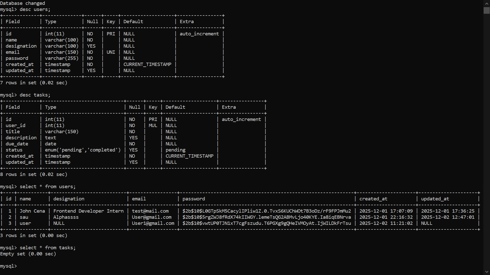

### Signup Page
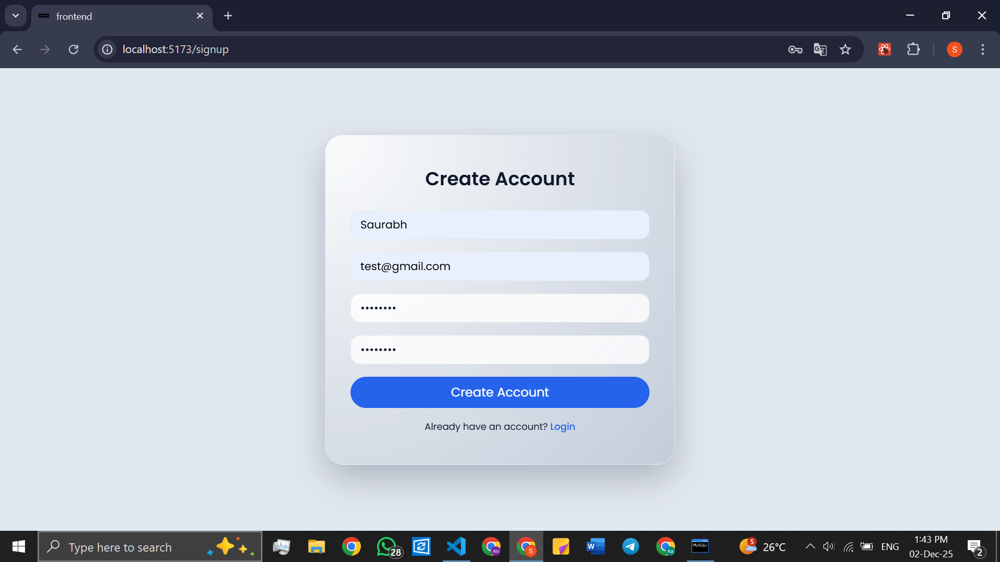

### New User updated in DB
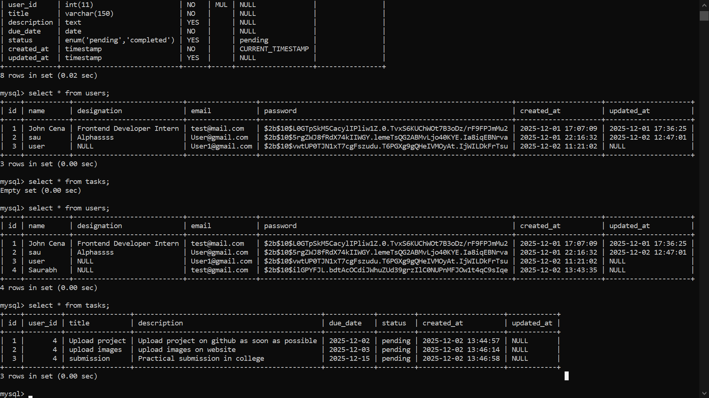

### Frontend(Landing) Page 
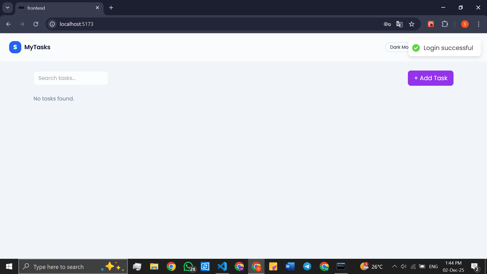

### Acount Created
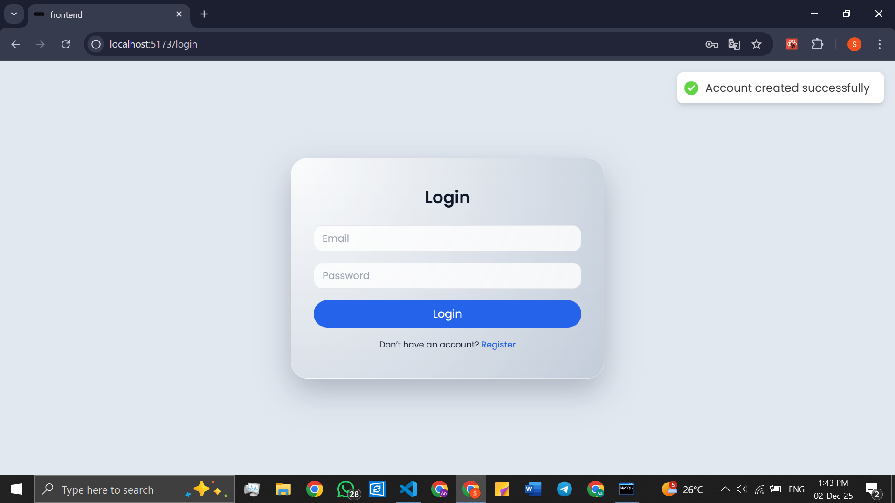

### Profile Updated
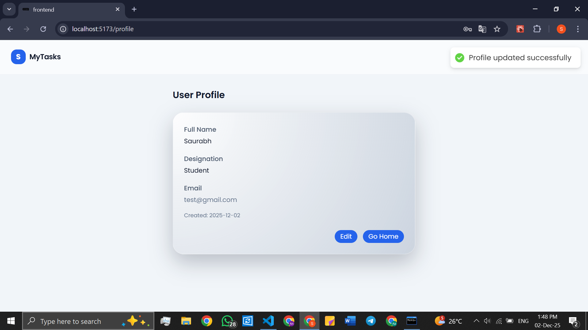

### After Logging out
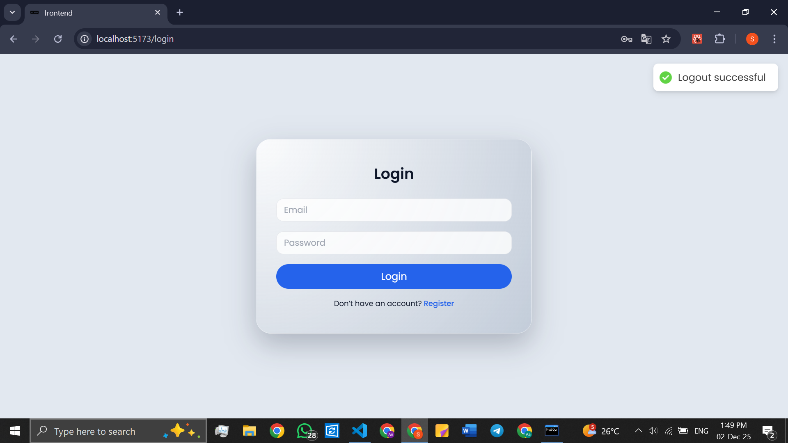

## Tasks
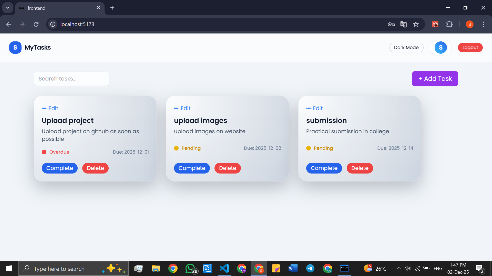

### Tasks Completed
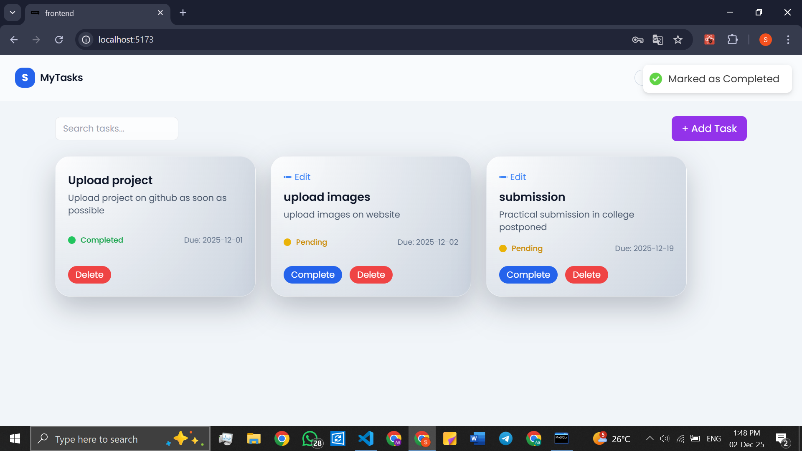

### Tasks Updated
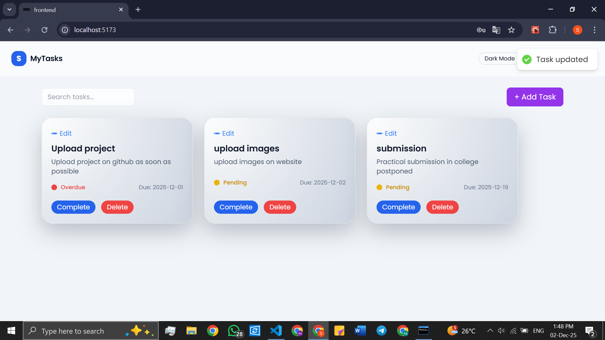

### Tasks Deleed


### Dark Mode
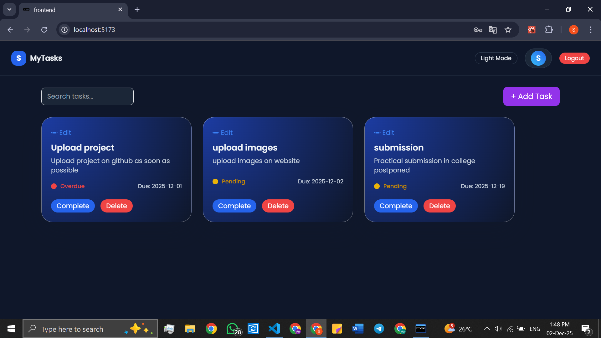


## 🧩 Key Features
- Authentication (JWT)
- Create/Edit/Delete Tasks
- Mark Completed
- Auto Overdue Detection
- Live Search
- Profile Update
- Theme Switch
- Responsive UI

## 🧠 Tech Stack
**Frontend:** React, TailwindCSS, Axios, Context API  
**Backend:** Node.js, Express, JWT, MySQL, Express Validator

## 🗂 Folder Structure
MyTasks/
 backend/
 frontend/

## 🔐 Environment Variables

Backend .env:
```
PORT=5000
DB_HOST=localhost
DB_PORT=3306
DB_USER=root
DB_PASS= YOUR_MYSQL_PASSWORD
DB_NAME=mytasks
JWT_SECRET=yoursecretkey
JWT_EXPIRES_IN=30d
```

Frontend .env:
```
VITE_API_URL=http://localhost:5000/api
```

.gitignore:
```
backend/.env
frontend/.env
```

## 🛠 Setup

Clone repo:
```
git clone <repo-url>
cd MyTasks
```

### Backend
```
cd backend
npm install
npm run dev
```

### Frontend
```
cd frontend
npm install
npm run dev
```

## 🧪 MySQL Schema
```
CREATE TABLE users (
  id INT AUTO_INCREMENT PRIMARY KEY,
  name VARCHAR(100),
  email VARCHAR(100) UNIQUE,
  password VARCHAR(255),
  designation VARCHAR(100),
  created_at TIMESTAMP DEFAULT CURRENT_TIMESTAMP,
  updated_at TIMESTAMP NULL
);

CREATE TABLE tasks (
  id INT AUTO_INCREMENT PRIMARY KEY,
  user_id INT,
  title VARCHAR(150),
  description TEXT,
  due_date DATE,
  status ENUM('pending','completed') DEFAULT 'pending',
  created_at TIMESTAMP DEFAULT CURRENT_TIMESTAMP,
  updated_at TIMESTAMP NULL,
  FOREIGN KEY (user_id) REFERENCES users(id) ON DELETE CASCADE
);
```
